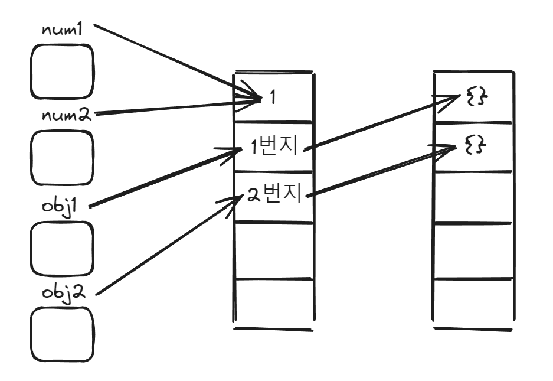

## 원시 타입과 객체 타입

- 자바스크립트의 데이터 타입은 크게 두 가지로 구분할 수 있습니다.
- 하나는 원시 타입이고, 다른 하나는 객체 타입입니다.

### 원시타입
- **원시 타입**은 아래와 같은 6가지로만 구성됩니다.
  
		1. 숫자
		2. 문자열
		3. 불리언
		4. undefined
		5. null
		6. 심벌(ES6이후 추가)

- 원시 타입의 값은 변경이 불가능한 값으로 **불변성**을 가지고 있습니다.
- 여기서 주의할 점은 변경 불가능한 것은 변수가 아니라 **값**이라는 점입니다.
- 변수는 재할당을 통해 값을 변경할 수 있지만, 값은 한 번 메모리에 할당되면 읽기만 가능할 뿐 변경 불가능한 값이 됩니다.
- 변수가 원시 타입의 값을 할당하게 되면 변수에는 주소가 아니라 **실제 값**이 저장이 됩니다.

### 객체타입
- **객체 타입**은 원시 타입 이외의 모든 자료형을 지칭합니다.
- 대표적으로 객체, 함수, 배열 등이 이에 해당한다고 볼 수 있습니다.
- 객체 타입은 변수 값에 대한 수정이 일어나면 메모리 값이 변경되는 **가변성**을 지닙니다.
- 객체 타입은 메모리에 저장되어 있는 주소를 통해 실제 값에 접근하기 때문 **참조 타입**이라고도 불립니다.


```javaScript
var num1 = 1;
var num2 = 1;

var obj1 = {};
var obj2 = {};

console.log(num1 === num2); // true
console.log(obj1 === obj2); // false
```



## null은 원시 타입인데 typeof 연산자를 사용하면 object가 반환되는 이유

- null은 변수에 값이 없다는 것을 명시하고 싶을 때 사용하는 **원시 타입의 자료형**입니다.
- 그러나 typeof 연산자를 사용하면 다른 원시 타입과 달리 object가 반환이 됩니다.
- 이는 자바스크립트라는 언어를 만들면서 생긴 **첫 번째 버그**로 기존 코드에 영향을 줄 수 있기 때문에 수정되지 않았다고 합니다.
- 따라서 null 타입인지 확인을 할 때 typeof 연산자가 아닌 일치 연산자를 사용해아 합니다.

```javaScript
// type 연산자를 통해 null 타입 검사
console.log(typeof null); // object

// 일치 연산자를 사용하여 null 타입인지 확인
var x = null;
console.log(x === null); // true
```
## 리터럴(literal)

- 리터럴은 사람이 이해할 수 있는 문자 또는 약속된 기호를 사용해 값을 생성하는 표기법입니다.
- 자바스크립트 엔진은 코드가 실행되는 시점인 **런타임**에 리터럴을 평가해 값을 생성합니다.
- 3이라는 값을 생성을 해보겠습니다.
- 아라이바 숫자 3을 사용해 코드에 기술하면 자바스크립트는 이를 평가해 숫자 값 3을 생성합니다.
- 하지만, 로마 숫자  Ⅲ을 사용해 코드에 기술하면 자바스크립트는 이를 평가해 숫자 값 3을 생성해 내지 않습니다. 

```javaScript
var num1 = 3; // 아라비아 숫자
var num2 = Ⅲ; // 로마 숫자 ... Uncaught ReferenceError: Ⅲ is not defined
```
- 정리하면, 리터럴을 사용하면 **다양한 종류의 값을 생성**할 수 있지만 **미리 약속된 표기법**을 따라야 합니다. 